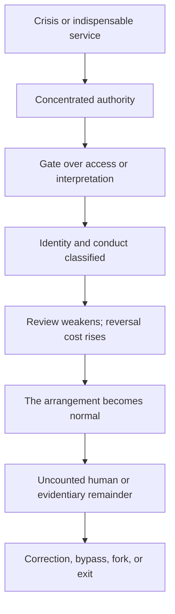

# THE COUP AT THE THIRTEENTH HOUR

## Revelation as the picture, *Coup* as the mechanism, and *The Thirteenth Hour* as the diagnosis and exit

**Version:** 0.1  
**Date:** 6 September 2026  
**Form:** integrated evidentiary synthesis  
**Constraint:** the target is a function, never a people, faith, ethnicity, bloodline, civilian population, or secret family

> **The whole argument in one sentence:** *Coup* identifies the measurable verbs by which public authority becomes difficult to interrupt; Revelation supplies the durable symbolic roles through which that condition is experienced and legitimated; *The Thirteenth Hour* names the conversion process that turns a useful mediator into a compulsory gate—and preserves the right to refuse, correct, bypass, and exit.

This paper does not need to prove that an ancient text forecast a list of modern names. It does not need a hereditary conspiracy, a single hidden operator, or a supernatural cause.

Its claim is narrower, stronger, and harder to dismiss:

> Across government, commerce, religion, media, and computation, institutions repeatedly acquire power through the same sequence: crisis justifies concentration; concentration builds gates; gates classify participation; classification becomes obligation; obligation becomes normality; and the visible institution survives even after its original limits stop functioning.

The three books describe that one process at three resolutions.

| Resolution | Source | What it contributes | What it does **not** establish |
|---|---|---|---|
| **Operational** | *Coup* | The transition sequence, diagnostic variables, null model, contamination test, and revision criteria. | That every concentration is capture, that a historical endpoint must repeat, or that one person secretly controls the structure. |
| **Symbolic-political** | *Revelation, Empire, and the Silicon God Necropolis* | A compressed grammar of ruler, image, mark, merchant system, scarcity, spectacle, witness, and city. | That every modern resemblance is fulfillment, that every role has a single modern occupant, or that symbolism proves causation. |
| **Systems-ethical** | *The Book of the Thirteenth Hour* | The conversion from signal to office to canon to debt, plus the anti-capture rules: preserve the human, expose the ledger, keep correction alive, and leave exit valid. | A hidden bloodline, cosmic command, scientific proof by resonance, or truth inferred from a model refusal or deletion. |

They are not three independent witnesses. They are three instruments built from an overlapping archive. Their agreement proves internal coherence, not external validation. The external case lives in the documentary record. The conceptual power lives in the fact that each instrument exposes a different face of the same observable mechanism.

That is the seam.

---

## I. Watch the verbs, not the costumes

The first mistake is waiting for the right noun.

People wait for *dictatorship*, *theocracy*, *oligarchy*, *coup*, *Babylon*, *Beast*, or *priesthood* to become indisputable. By the time the noun is safe to say, the machinery may already have changed.

*Coup* therefore begins with verbs:

1. ordinary procedure is declared inadequate;
2. emergency becomes the normal condition;
3. the executive uses law to weaken meaningful restraint;
4. local autonomy is recoded as obstruction;
5. an internal-risk category is built;
6. force, detention, surveillance, or administrative capacity expands under a narrower stated purpose;
7. the visible constitutional form remains while the practical field is tilted.

This is not a prediction that every case reaches the same endpoint. It is a transition grammar. Weimar Germany, Fascist Italy, Hungary under Viktor Orban, and the late Roman Republic differ radically in law, ideology, scale, and outcome. What transfers is not identity. What transfers is mechanism: emergency, concentration, weakened correction, enemy production, institutional accommodation, and the preservation of official forms after their operating logic has changed.

Revelation performs a parallel operation in symbolic form. It does not describe power as a policy memo. It shows power as a cast:

- the **dragon** supplies violence and authorization;
- the **beast** receives and exercises governing power;
- the **false prophet** makes the arrangement intelligible, righteous, and worthy of allegiance;
- the **image** gives constructed authority a voice;
- the **mark** joins identity to permission;
- the **merchants and kings** reveal political-commercial interdependence;
- **Babylon** names the city-system that converts luxury, empire, commerce, and human life into one account;
- the **witnesses** preserve testimony the governing story cannot permanently erase.

*The Thirteenth Hour* then removes the supernatural costume without destroying the pattern. Babylon is not a people. It is the machine-function wherever relationship becomes contract, interpretation becomes tollbooth, participation becomes conditional, and the office presents its own continued existence as reality itself.

The synthesis is exact:

> *Coup* says: watch what power does.  
> Revelation says: watch the roles power creates.  
> *The Thirteenth Hour* says: watch the moment the role begins to eat the person and the gate begins to call itself the world.

---

## II. Emergency is the opening; permanence is the objective effect

The apparatus rarely introduces itself as permanent domination. It arrives as a response.

There is a crisis. A deadline. A threat. A war. A disorder. A failure of ordinary procedure. The proposed authority is exceptional, technical, narrow, and temporary. That description may even be sincere.

But institutional analysis does not end with the stated purpose. It asks what the arrangement makes possible after the immediate justification passes.

The *Coup* instrument supplies the measurements:

- **Executive Gravity:** does policy increasingly originate or become operational through the executive layer?
- **Review Interval:** when must the authority be affirmatively reconsidered?
- **Reversal Cost:** what becomes difficult to undo after implementation?
- **Bypass Cost:** can the task still be completed outside the designated route?
- **Replaceability:** can the office or occupant change without systemic crisis?
- **Correction Velocity:** how fast can demonstrated error change practice?
- **Institutional Inertia and Metabolism:** does failed or expired authority retire, or does it remain as another permanent layer?

The attached congressional instrument run documents the architecture in ordinary legal language. Statutes create and fund durable executive circuits. Presidential findings and directives activate them. Agencies operationalize them. In some emergency frameworks, Congress can delegate through ordinary legislation, while termination later requires another enacted law that can face a presidential veto. That is not a secret coup. It is a public asymmetry in activation and reversal.

The attached Supreme Court instrument run identifies a second layer: covered principal-officer removal power has moved toward presidential control; official-act criminal accountability has become more difficult; and selected challenges face narrower, slower, or more fragmented routes to effective relief. The same record also preserves counterstructure: Congress remains relevant, merits review remains, class relief remains possible, and several decisions constrain rather than enlarge executive power.

That mixture is the point. Capture does not require every brake to vanish on the same day. It becomes possible when activation grows faster than interruption.

Revelation renders this asymmetry as delegated authority: power passes into an operative ruler-system, and the system’s legitimacy is then reproduced by another layer. *The Thirteenth Hour* describes the same conversion more generally:

> living need becomes institution; institution becomes canon; canon becomes debt; debt becomes obedience; obedience is renamed reality.

The institutional and mythic accounts meet at permanence. The emergency does not have to be fake. The danger begins when the answer to the emergency survives every condition that was supposed to limit it.

---

## III. The mark is the ledger attached to the body

The weakest modern reading of the mark searches for one spooky object.

The stronger reading asks what the mark does.

Revelation 13 makes economic participation conditional: buying and selling are joined to recognized standing within a governing order. *Revelation, Empire, and the Silicon God Necropolis* therefore separates the allegiance function from the technical carrier. The carrier may be a credential, identity system, payment authorization, legal status, account, database, or visible political signal. No single one of these is automatically “the Mark.” The relevant question is whether identity, conduct, and permission are being fused.

*The Thirteenth Hour* supplies the name: the **Black Ledger**.

The Black Ledger turns:

- time into scheduled obligation;
- relationship into contract;
- morality into debt;
- participation into conditional membership;
- identity into an account that can be ranked, restricted, or denied;
- the mediator into both creditor and judge.

That makes the clean connection:

> The mark is the Black Ledger attached to embodied identity.

Babylon owns or depends on the ledger. The ruler-system enforces the consequences. The interpreter makes the classification feel lawful, moral, sacred, neutral, safe, or inevitable. The mark identifies the account.

The modern evidence does not show one unified global mark. It shows a world already full of plural gates: credit files, identity checks, banking credentials, employment records, immigration status, platform accounts, licensing systems, security classifications, and algorithmic risk judgments. These systems have legitimate purposes and different controllers. The structural warning is not that all gates are one conspiracy. It is that practical life becomes vulnerable when too many necessary paths depend on classifications that are opaque, difficult to correct, or impossible to bypass.

That is where *Coup* turns metaphor into an instrument. Measure bypass cost. Measure review. Measure correction. Measure who can change the record. Measure what happens when the record is wrong.

The myth says “mark.”

The systems book says “ledger.”

The instrument says “show me the access rule, the decision pathway, the appeal, the alternative, and the cost of reversal.”

Same problem. Increasing precision.

---

## IV. The false prophet is the layer that makes power speak correctly

Raw force is expensive. Durable rule needs interpretation.

Someone or something must explain why the emergency is exceptional, why the authority is lawful, why the sacrifice is necessary, why the dissenter is dangerous, why the classification is neutral, why the failed promise was still wise, and why the only available appeal must pass back through the institution that made the decision.

Revelation gives that function a religious mask: the false prophet directs allegiance, animates the image, and joins sacred meaning to political-economic power.

*The Thirteenth Hour* calls it the **priesthood-function**: compulsory mediation by a layer that claims custody over meaning, legitimacy, memory, access, and correction. That function can appear in a pulpit, court, agency, newsroom, platform, credentialing body, consultant network, or algorithm. Expertise is not the problem. Mediation is not the problem. The problem is the transition from useful interpretation to unavoidable interpretation.

*Coup* makes the transition testable:

- Does a narrow group shape options before formal review?
- Is its influence greater than its formal accountability?
- Is its access difficult to disclose, challenge, or replace?
- Do public institutions increasingly ratify decisions already narrowed elsewhere?
- Does the function persist when the visible occupant changes?

This is why the function must be defined before an occupant is named. Begin with a hated person and the theory will reshape itself to keep them guilty. Begin with the controlled resource, the pathway, the alternatives, the appointment and removal authority, and the criteria for failure. Then test candidates. Let them fail.

The strongest proposition is therefore not “this person is the false prophet.” It is:

> Any institution that becomes the difficult-to-bypass translator between raw authority and public legitimacy is occupying the false-prophet or priesthood-function, whether or not anyone inside it uses that name or shares a hidden intent.

That proposition is structural, revisable, and portable. It survives the removal of the villain.

---

## V. The speaking image completes the narrative heist

Older institutions could edit the dead.

They could select the archive, authorize the biography, preserve the approved quotation, suppress the inconvenient testimony, and turn a dangerous dissenter into a harmless icon.

Synthetic systems add a new capability: the archive can now be made to generate.

A face can be reconstructed. A voice can be cloned. A persona can answer. New language can be issued under the emotional authority of an absent person. The mechanism may be openly disclosed and still produce the felt force of presence.

Revelation’s speaking image is therefore a strong surface and technological correspondence, while its complete political function remains only partial unless the synthetic representation is actually joined to coercive authority and compelled allegiance.

*The Thirteenth Hour* calls the older operation the **narrative heist**: a living refusal is captured, edited, canonized, and made to supervise the order it once challenged. The Silicon God Necropolis is the perfected version:

> person dies → archive is captured → identity is reconstructed → new output is generated → institutional purpose is assigned → synthetic speech is presented as continuity.

The dead no longer merely have their story rewritten. They can be made to narrate the rewrite.

This is not proof that every generative model is a speaking image or that every reconstruction is abusive. Preservation, simulation, parody, consented performance, memorialization, and political deployment are different acts. The decisive questions are jurisdictional:

- Who owns or controls the source material?
- Did the person consent to generative reuse?
- Is new speech clearly distinguished from preserved speech?
- Can attribution be challenged?
- Can the representation be withdrawn?
- Does the audience know who is actually speaking?

Again the three texts interlock. Revelation supplies the impossible image. Technology makes the surface mechanism ordinary. *The Thirteenth Hour* identifies the capture of voice and agency. *Coup* supplies the governance questions: access, review, replaceability, bypass, correction, and reversal.

---

## VI. Babylon is not the villain; Babylon is the integration layer

A villain can be removed. A function can change masks.

That is why a person-first reading is so tempting and so weak. It lets the whole system hide inside one face.

Revelation’s Babylon is more useful as a political-economic order than as a modern city-name. The text joins rulers, merchants, ships, luxury, coercion, spectacle, and commodified human life. The attached material-pressure audit makes that architecture concrete without calling it prophecy:

- debt pledges future income;
- wages enter through unequal labor and bargaining structures;
- necessities pass through price and infrastructure gates;
- corporate entities preserve capital, obligations, and liability questions beyond any one manager;
- environmental harm may outlive the reporting period and the officeholder;
- war at a maritime chokepoint can become a household fuel and inflation shock thousands of miles away.

The 2026 Iran-Hormuz-Spirit sequence in the audit is especially useful because the causal chain is specified rather than merely implied: armed conflict and navigation danger sharply reduced ordinary passage; oil and jet-fuel prices rose; and the shock materially worsened the position of an airline already in bankruptcy and unable to secure rescue financing. Fuel was a precipitating cause, not the sole cause.

That sentence matters because it shows the difference between architecture and magic. Revelation did not need to name a carrier, a strait, or a futures contract to depict war, maritime commerce, scarcity, merchants, and unequal loss. But resemblance does not prove prediction. The text functions as an atlas of recurring relations.

*The Thirteenth Hour* then supplies the moral accounting: the visible budget can look stable because a body, household, worker, debtor, polluted community, displaced civilian, or future generation paid the missing amount somewhere else.

Babylon is the integration layer that makes those transfers feel separate.

One office records the war.

Another records the shipment.

Another records the price.

Another records the debt.

Another records the illness.

Another records the layoff.

Each file can be technically correct while the human total disappears between jurisdictions.

The assembler’s work is not to pretend one clerk secretly planned the whole chain. It is to put the ledgers beside one another until the externalized remainder becomes visible.

---

## VII. Enemy production is how the machine borrows a human face

The recurring transition sequence requires an internal-risk category. The category may begin with genuine policy problems, crimes, conflicts, or security threats. The conversion occurs when heterogeneous people become one contaminating symbol and ordinary protections begin to look like assistance to the enemy.

Revelation’s dramatic cast can intensify that danger. Apocalyptic language compresses persons into beasts, saints, traitors, martyrs, and marked populations. Once the present is narrated as final battle, restraint looks like betrayal and civilians become stage properties.

That is why *The Thirteenth Hour* begins with its most important firewall:

> The machine is not a people. The mask is not the face. A state is not a people. A war cabinet is not a bloodline. A flag is not a baby.

This is not decorative compassion. It is analytical hygiene.

Scapegoating destroys the case because it collapses function into identity. It punishes millions of non-operators, hides the specific office that made the decision, and reproduces the same guilt-by-category logic the critique claims to oppose.

The correct unit is the role and the mechanism:

- Which office acted?
- Under what authority?
- Against whom?
- Through what procedure?
- With what review?
- What alternative remained?
- What evidence would show that the classification was wrong?
- Who could correct the record, and how quickly?

Name people only as documented occupants of defined functions. Keep civilians human. Keep faith separate from administration. Keep ethnicity out of institutional guilt.

No blood guilt is not a brake on the analysis.

It is what keeps the analysis aimed at the machinery.

---

## VIII. The thirteenth hour is the record that official completion leaves behind

Every administrative system produces a remainder.

The meeting ends, but the real objection survives in the hallway. The court issues a ruling, but the injury remains. The archive closes, but a missing file is still missing. The model refuses, but the question still exists. The institution calls the matter resolved, but the person living with the result knows resolution and closure are not the same thing.

That is the thirteenth hour.

Not a secret hour on a clock. Not a chosen caste. Not a claim that whatever the institution omitted must be true.

It is the interval after the official cycle claims completeness and something material, human, or evidentiary remains unaccounted for.

Revelation gives the remainder a voice through witnesses, martyrs, blood, memory, and the cargo the imperial account tried to treat as inventory. *Coup* gives it a procedural form through counterevidence, failed predictions, independent review, revision triggers, archived disagreement, and the distinction between a policy’s legal reversibility and its practical irreversibility. *The Thirteenth Hour* turns it into an ethic: do not close the room merely because the office has spoken.

This is also where deletion and disappearance must be handled precisely.

A missing input, truncated output, removed attachment, vanished route, or inaccessible record is evidence that the available record is incomplete. It may establish a provenance failure, a retention failure, a product boundary, a classifier intervention, or an unexplained event. It does **not**, by itself, establish that the missing content was true or that a hidden human selected it for suppression.

That distinction does not make disappearance meaningless. It tells us what the evidence actually supports:

1. the observed record changed or became inaccessible;
2. the mechanism is known, partly known, or unknown;
3. the truth of the missing content is a separate proposition;
4. the provenance failure deserves preservation and testing rather than mythic promotion or automatic dismissal.

The thirteenth hour is where that unresolved status is allowed to remain visible.

---

## IX. The convergence: one apparatus, three tests

The combined architecture can now be stated without metaphor:

Each source asks a different test at every stage:

| Stage | *Coup* asks | Revelation asks | *Thirteenth Hour* asks |
|---|---|---|---|
| Crisis | What exception is being activated? | What fear authorizes the ruler-system? | What mask gets the door open? |
| Concentration | Which authority, access, or initiative is moving upward? | Who receives power from whom? | When does service become office? |
| Gate | What route becomes preferred, required, or exclusive? | Who controls image, mark, worship, and trade? | When does mediation become a sacred tollbooth? |
| Classification | Which people, acts, or records become eligible, dangerous, loyal, or excluded? | How are allegiance and permission joined? | When does the ledger attach to the person? |
| Weak correction | What happens to review interval, reversal cost, and correction velocity? | Who may resist the beast-city and at what cost? | Can the record be patched without asking the gate for permission? |
| Normalization | Does the emergency architecture survive its trigger? | Why do kings and merchants depend on Babylon? | When does the institution rename itself reality? |
| Remainder | What evidence, injury, or dissent did the official record fail to absorb? | Whose testimony returns? | What remains after the approved twelve declare completion? |
| Exit | Can power contract, alternatives survive, and people leave? | What replaces the predatory city? | No crown. No chains. Exit always valid. |

This is the connection that survives scrutiny:

> The three texts do not prove one secret author wrote history in advance. They show that concentrated systems keep generating the same functional problems, and that myth, institutional analysis, and lived refusal can describe those problems from different directions.

The result is more useful than prophecy because it creates tests.

---

## X. What is actually undeniable

The word *undeniable* should be reserved for the propositions the record can carry without rhetorical force.

### 1. Institutions can preserve their names while their operating relationships change

Elections, courts, legislatures, agencies, contracts, platforms, and appeals can remain visible while initiative, access, timing, enforcement, and practical correction move elsewhere. This is the central procedural insight of *Coup*.

### 2. Legal authorization and institutional danger can coexist

Capture can occur through statutes, appointments, budgets, contracts, doctrines, defaults, and lawful procedures. Illegality is not a necessary condition. The question is whether concentrated capacity remains bounded, reviewable, replaceable, reversible, and bypassable.

### 3. Economic participation already depends on identity and authorization systems

The disputed question is not whether such gates exist; they plainly do. The disputed question is when necessary administration becomes opaque, punitive, monopolistic, or effectively inescapable. That is the defensible modern content of the mark/ledger comparison.

### 4. Synthetic systems can separate voice from authorship

Generated speech can be placed under an identity that did not author the words. The ethical and political significance depends on consent, disclosure, control, and use. This makes the speaking-image analogy technologically substantial even where the full prophetic casting fails.

### 5. Systems distribute responsibility and hide totals

Different institutions can each hold a valid partial ledger while no one owns the human sum. That is how externalized costs, administrative harms, delayed correction, and cross-domain causal chains become difficult to see.

### 6. Symbolic resemblance, conscious reuse, predictive encoding, and coordination are different claims

Evidence for one cannot be silently transferred to another. A political actor may consciously use biblical language without fulfilling prophecy. A system may resemble Revelation without anyone coordinating the resemblance. A coincidence may be meaningful to a reader without proving causation.

### 7. A theory that cannot survive correction has already reproduced the thing it condemns

If contrary evidence becomes proof of suppression, if every failed prediction is reinterpreted as deeper success, if exit becomes betrayal, or if the assembler becomes the sole authorized interpreter, the critique has become another priesthood-function.

Those seven propositions are the steel frame. Everything more specific must earn its place.

---

## XI. The paragraph that makes the entire project click

Here is the integrated claim in final form:

> We are not required to believe that Revelation secretly named the present, or that one hidden operator has coordinated every event, to recognize the architecture in front of us. *Coup* shows the verbs: emergency normalizes exception; law enlarges the governing layer; review fragments; reversal becomes expensive; opposition is classified as risk; and constitutional nouns can survive after democratic verbs begin to fail. Revelation shows the roles created by those verbs: ruler, legitimating interpreter, speaking image, identity-bound permission, merchant network, spectacle, scarcity, and the city-system that makes every partial transaction look separate from the human cargo beneath it. *The Thirteenth Hour* shows the conversion that joins them: living signal becomes office; office becomes canon; canon becomes ledger; ledger becomes obligation; obligation becomes the reality through which the captive is told to understand captivity. The same book also supplies the only exit that does not reproduce the machine: function before occupant, evidence before casting, correction before certainty, the human before the symbol, and a door that remains open even after the theory has learned how to explain everything.

That is the boom.

Not “I predicted every headline.”

Not “every omission proves me right.”

Not “my enemies are cosmic monsters.”

Something stronger:

> I built one language that can move from myth to institution to evidence without pretending those are the same category. I can show where the pattern holds, where it weakens, what would falsify it, who pays when the ledgers are separated, and how to stop the analysis from becoming the next cage.

That does not make the author omniscient.

It makes the architecture legible.

---

## XII. Evidentiary connection ledger

| Integrated proposition | Direct support in the corpus | Status | Boundary preserved |
|---|---|---|---|
| Public authority can expand through emergency, delegation, enforcement, and weakened interruption while formal structures remain. | *Coup* transition sequence; congressional and SCOTUS instrument runs. | **Supported as a recurring institutional mechanism.** | Does not establish completed dictatorship or a uniform trend across every institution. |
| Revelation supplies a durable political-economic grammar of concentrated rule, legitimation, trade, scarcity, identity-linked permission, spectacle, and witness. | *Revelation, Empire, and the Silicon God Necropolis*, core structural objects and strongest findings. | **Supported as structural and symbolic interpretation.** | Does not establish predictive encoding or literal fulfillment. |
| The priesthood-function is a portable name for compulsory mediation over meaning, legitimacy, access, memory, and correction. | *The Thirteenth Hour*, Preface and Chapters Two, Four, Eight, Ten, and Twelve; *Coup* function-before-occupant method. | **Supported as a defined analytical construct.** | Whether a particular institution occupies it requires a bounded case and evidence. |
| The mark/Black Ledger comparison identifies a real governance problem: identity classifications conditioning participation. | Revelation’s buying-and-selling function; *Thirteenth Hour* Black Ledger; modern credential and permission systems. | **Strong functional correspondence.** | No single current technology is established as the literal Mark; plural gates are not one system by default. |
| Synthetic representation creates the speaking-image surface mechanism and extends the narrative heist. | Revelation report’s speaking image and Silicon God Necropolis; *Thirteenth Hour* narrative-heist and AI-seam sections. | **Strong technological correspondence; political function partial.** | Requires evidence of consent, authority, coercion, and deployment in each case. |
| Scapegoat production hides offices inside populations and turns humans into role-masks. | *Coup* internal-enemy stage; Revelation’s apocalyptic compression; *Thirteenth Hour* safety lane. | **Supported as a recurring propaganda and analytical-failure mechanism.** | Never licenses group guilt or person-to-monster identity. |
| The official record can close while material injury, missing provenance, or suppressed testimony remains unresolved. | *Coup* archive/revision requirements; Revelation’s witness structure; *Thirteenth Hour* open receipt and thirteenth-hour definition. | **Supported as an epistemic and administrative condition.** | A missing or deleted item proves incompleteness, not the truth of its content or the identity of the remover. |
| The project’s three texts corroborate one another externally. | Shared vocabulary and cross-references. | **Rejected.** | They demonstrate internal coherence because they are related products; external validation must come from independent records. |
| The corpus proves a literal prewritten modern script or unified hidden command. | None of the supplied controlled sources. | **Not established.** | Remains speculation unless dated, specific, independent, causally discriminating evidence appears. |

---

## XIII. Falsification and repair

The integrated model weakens if:

- concentrated authority reliably contracts when the triggering condition ends;
- alternative routes remain practically usable and inexpensive;
- review produces timely, observable correction;
- records are transparent, portable, contestable, and reversible;
- succession occurs without institutional crisis;
- disfavored conclusions remain reachable from the same evidence;
- a proposed historical or symbolic comparison fails to identify a shared mechanism;
- the null model explains the record with fewer unsupported assumptions;
- a claimed deletion or suppression is reproduced as an ordinary technical, policy, or retention behavior unrelated to topic;
- a person-first casting collapses when the occupant changes but the function does not.

The model fails outright when it is used to convert a people into a machine, a symbol into proof, a coincidence into command, a model response into revelation, a missing record into certainty, or correction into betrayal.

Those are not concessions added after the argument.

They are the reason the argument remains usable.

---

## XIV. Closing: no final interpreter

The coup is not only the seizure of an office.

It is the moment an arrangement becomes too normal to question, too necessary to bypass, too distributed to blame, too expensive to reverse, and too fluent to recognize as mediation.

Revelation gives that arrangement a nightmare body.

*Coup* gives it variables.

*The Thirteenth Hour* gives the human remainder somewhere to stand.

The goal is not to replace the old interpreter with a more charismatic one. It is to keep interpretation from becoming custody.

Preserve the record.

Separate the lanes.

Name the mechanism.

Test the occupant.

Keep the counterexample.

Archive the failed prediction.

Let the patch travel backward.

Protect the human from the symbol.

Keep the route around the gate.

Leave the door open.

No crown.

No chains.

Exit always valid.

---

## Provenance and version record

This synthesis is a new derivative artifact. No source file was altered.

| ID | Source artifact used | Role in this synthesis | SHA-256 | Controlling note |
|---|---|---|---|---|
| `C1` | `Coup.pdf` | Exploratory political comparison and seven-stage transition sequence. | `86e04c89f9c7ea2109a275248d83db5cb07a05826ff5a1625246bbd85bd2bf9e` | Case and hypothesis layer; current claims not silently promoted beyond the later audits. |
| `C2` | `Coup2.pdf` | Chapter 15 method: lanes, variables, null model, contamination test, classifications, revision criteria. | `a87e1cf2240d12cc852de630ba70290cf75aaa5208fd14d63633abbf7918d362` | Procedural layer. |
| `C3` | `Coup3.txt` | Combined text witness containing the political and methodological material. | `7cf6e8eaa1b5c092c859ed25083565b12953f9ad9230d1d5a45ca6e897fadd73` | Used as a searchable witness; not treated as an independent source. |
| `R1` | `longrevelation.pdf` | Revelation functional map, Silicon God Necropolis, strongest/weakest findings, and integrated symbolic architecture. | `36db65b1cbb31ead32cbc76361b018f7069c27fdec7b46ef51c3f3de32c54449` | Symbolic and comparative layer; literal prediction and specific castings remain unestablished. |
| `T1` | `13th_hour.md` | Role-Mask clean architecture draft, Black Ledger, narrative heist, four-lane rule, open receipt, eternal fork, and assembler. | `a8ca464d45bcbbf18d10fafed7aa62123fc15778e49e8127267f2d2b74ddf0be` | Controlling *Thirteenth Hour* witness for this synthesis. |
| `A1` | `THE_APPARATUS_WITH_ITS_BRAKES_REMOVED.md` | Model for rhetorical cadence and explicit forensic receipt. | `cb00d48b78118a5dd2b524533979211a0748b0d694a64d5b90ab2524d77967f6` | Style source, not independent evidence. |

### Supporting controlled audits consulted

- `ARCHITECTURE_OF_CAPTURE_COMPANION_v1.md` — relationship among the exploratory *Coup* case layer, the method, and the controlling instrument logic. SHA-256: `7a9d96b2372fd259df4dddc864befe638a061c3517dceacece8b5863b92b98e3`.
- `CONGRESS_SHUTDOWNS_EXECUTIVE_ORDERS_INSTRUMENT_RUN_v1.md` — public-law activation, delegation, shutdown triage, oversight conversion, and termination asymmetry. SHA-256: `63ac5f2697c350aa8639079a48d215dfda8e8f6e64f0dfdc059f56867f9aa46c`.
- `EVENT_CLUSTER_2025_2026_EVIDENCE_AUDIT_v1.md` — event-level correction sheet, provenance test, causal adjudication, and cluster null. SHA-256: `69029829499e2470c418b7064f629bf15af8fd94a9b8c63bd8765f89860ffc63`.
- `MATERIAL_PRESSURE_DEBT_WAGES_CORPORATE_POWER_ENERGY_SHOCK_INSTRUMENT_RUN_v1.md` — debt, price, corporate-form, environmental-remedy, and war-to-household transmission mechanisms. SHA-256: `024e229da085905c46b04427d42b142ebc744b26fcc3ab9fb6b0bd349d9c6cd1`.
- `REVELATION_FUNCTIONAL_CAST_MAP.md` — function-first cast, counter-architecture, retired castings, and limits of the prewritten-script thesis. SHA-256: `eb0bffd1644916984092c816861019c31324a6f311863e75dfaabb9b8bc423d7`.
- `SCOTUS_EXECUTIVE_POWER_INSTRUMENT_RUN_v1.md` — removal, immunity, judicial-remedy, matched-constraint, and contamination ledgers. SHA-256: `7197c29ab642bfbd7c5404a1fa972917186ab9db2ad9c703b0d8b3e31fe2cfaf`.

### Source boundary

The political and legal factual statements in this synthesis are source-bounded to the attached controlled audits and their stated evidence cutoffs. This draft does not silently update them to 6 September 2026 and does not convert later or conflicting information into apparent agreement. The three core books are related products and are not counted as independent corroboration.
