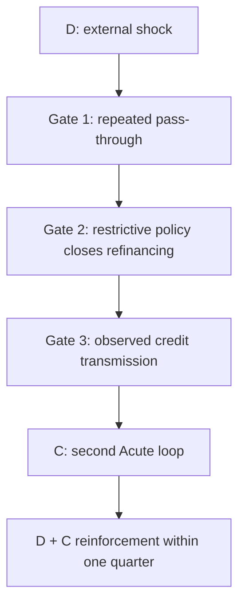

# THE 2026 WOBBLE DIAGNOSTIC v2.5

## Geometry and Coupling Patch — GP01

**Version:** 2.5-GP01

**Date:** 3 September 2026

**Status:** Method successor; non-scoring companion to v2.4

**Parent baseline:** Wobble v2.4, frozen 17 August 2026

**Rule:** This patch sharpens state, coupling, quotient, and closure language. It contributes zero external-world evidence and does not rewrite the frozen baseline or post-freeze ledger.

---

## 0. Disposition

The new geometry helps, but only after one hard separation:

> The Wobble is not being declared a physical torus. Toroidal, quotient, cocycle, and residual machinery enter here as audit grammar, not as evidence about the economy, politics, institutions, or the universe.

The high-value upgrade is operational. Earlier versions required a second Acute loop plus observed cross-domain reinforcement before Phase III Watch, but “reinforcement” still needed a cleaner receipt. This patch supplies that receipt.

### Frozen state carried forward without alteration

- Overall geometry: **WIDE**.
- Near-term cascade path: **NARROWED**.
- Classification: **Phase II / PRE-WATCH**.
- **D External Shock:** ACUTE.
- **A Debt-Energy, B AI Cost-Capture, B-2 AI Price-Level, F Adaptive Depletion, G Fixed-Cost Ratchet:** ACTIVE.
- **C CRE/Credit, E Demographic Torque, H Policy Latency:** BACKGROUND-TO-ACTIVE.
- Phase III Watch still requires both:
  1. a second Acute loop; and
  2. observed cross-domain reinforcement.
- Scenario 8 still requires all three frozen gates:
  1. sustained supply-shock pass-through across more than one inflation print;
  2. a Fed hike or sufficiently restrictive path that closes refinancing channels; and
  3. observed CRE transmission into bank credit, small-business lending, or household income.

No loop is promoted, demoted, merged, or deleted by this patch.

---

## 1. Four namespaces that may not silently promote one another

| Namespace | What it can establish | What it cannot establish by itself |
|---|---|---|
| External evidence | Dated observations, source identity, measured movement, counter-signals | A Wobble state change without the frozen decision rule |
| Wobble state | Loop states, gate states, scenario status, phase classification | Causation, intent, or autonomous dynamics |
| Geometry method | Projection loss, path structure, typed edges, retained distinctions | Political, economic, or physical truth |
| Residual/closure test | Whether a declared reduced state has representative-independent successors | Empirical confirmation outside the tested domain |

The governing rule is:

> Evidence may update an eligible Wobble coordinate. Geometry may constrain how that update is represented. Neither geometry nor provenance supplies the evidence that moves the coordinate.

---

## 2. Full diagnostic state and phase projection

At verification node \(t\), retain the full diagnostic state

\[
S_t=(L_t,G_t,K_t),
\]

where

\[
L_t=(A_t,B_t,B2_t,C_t,D_t,E_t,F_t,G_t,H_t)
\]

is the typed loop-state record,

\[
G_t=(g_{\mathrm{pass}},g_{\mathrm{policy}},g_{\mathrm{credit}})
\]

is the Scenario-8 gate record, and \(K_t\) retains the context required to interpret the state: source and observation times, provenance, regional or national scope, counter-signals, competing routes, revisions, missing values, and applicable freeze boundaries.

Each loop remains categorical. This patch does not turn BACKGROUND, BACKGROUND-TO-ACTIVE, ACTIVE, and ACUTE into an assumed metric scale.

The public phase label is a projection:

\[
P_t=q_{\mathrm{phase}}(S_t).
\]

Phase II is therefore a lossy diagnostic quotient of the full state, not a sufficient dynamical state. Two records can share the same phase while differing materially in which loop is Acute, which gates are open, which repair channels remain available, and which counter-signals are active.

### Closure status

- **Phase-only autonomous law:** NOT CLAIMED.
- **Strong lumpability of the phase projection:** UNRESOLVED.
- **Reason:** no complete proof or domain-exhaustive test shows that all full states sharing a phase have the same aggregate next-phase law.

No transition matrix over phase labels may be treated as a closed forecasting law until that condition is met.

---

## 3. Coupling receipt: what “reinforcement” now requires

For a proposed directional coupling from loop \(i\) to loop \(j\), retain

\[
E_{i\rightarrow j,t}=
(i,j,M,O_i,O_M,O_j,\Delta t,W,C,P),
\]

with:

- \(i\): source loop;
- \(j\): target loop;
- \(M\): predeclared transmission mechanism;
- \(O_i\): eligible source-loop observation;
- \(O_M\): eligible observation of the intermediate mechanism;
- \(O_j\): eligible target-loop observation;
- \(\Delta t\): declared lag or interaction window;
- \(W\): witness/source architecture and any changes to it;
- \(C\): counter-signals and competing explanations;
- \(P\): provenance join connecting the observations to the frozen object.

### Edge states

| Edge state | Minimum meaning |
|---|---|
| PROPOSED | A predeclared mechanism names source, intermediate transmission, and target |
| ELIGIBLE | Timing, scope, source, and frozen-object requirements are satisfied |
| OBSERVED | Eligible observations exist at source, mechanism, and target in the declared window |
| REJECTED | A required link fails, reverses, or is contradicted under the frozen rule |
| UNRESOLVED | A required link, time, scope, or provenance edge is missing or ambiguous |

**OBSERVED is not a universal causal verdict.** It means that the predeclared transmission signature was observed with its limits retained. Causal language still requires evidence appropriate to that claim.

### Non-substitution rules

- Simultaneous loop movement is not automatically a coupling edge.
- A shared shock acting separately on two loops is not automatically \(i\rightarrow j\).
- Two compatible findings remain two findings until a source-bearing join is present.
- A publication date does not replace the underlying event or observation date.
- Capability does not replace deployment; deployment does not replace measured transmission.
- Active-loop breadth does not replace a second Acute loop.
- A route is not a consequence.
- An observed path is not an autonomous law.

---

## 4. Scenario 8 as a frozen directed path

The existing Scenario-8 mechanism can now be written without changing it:

The path is conjunctive. Skipping a gate, substituting proximity for transmission, or inferring the target from the source is a failed receipt.

### Scenario-8 decision table

| Condition | State |
|---|---|
| One or more gates missing, failed, or unresolved | Scenario 8 NOT BEGUN / UNRESOLVED as applicable |
| All three gates observed but C does not become Acute | Transmission observed; no Phase III Watch |
| C becomes Acute without an observed D↔C reinforcement receipt | Second Acute present; Phase III Watch condition incomplete |
| C becomes Acute and cross-domain reinforcement is observed within the frozen window | Phase III Watch condition met |

The table is a scoring firewall. It is not a forecast that the last row will occur.

---

## 5. Path bookkeeping and the cocycle boundary

An additive event-path record may be used for exact bookkeeping when its components and composition rule are declared. For adjacent eligible nodes, let \(\eta_t\) be the typed transition receipt, and for \(m<n\) let

\[
c_E(m,n)=\eta_m\oplus\eta_{m+1}\oplus\cdots\oplus\eta_{n-1},
\]

where \(\oplus\) means ordered receipt composition, not numerical addition unless a component has separately declared additive structure.

Then the only automatic claim is path composition:

\[
c_E(m,n)\oplus c_E(n,r)=c_E(m,r).
\]

This can preserve which gates, brakes, misses, and source changes occurred along a route. It does not show that the projected phase is Markovian, that a path was inevitable, or that the economy has a literal topological winding sector.

### Geometry not imported into Wobble

The following remain specific to their original domains and are not adopted as Wobble variables:

- \(q=W\bmod 2\), which is valid only on the declared divergence-free integer-winding domain;
- the eight parity sectors in \(\mathbb Z_2^3\);
- material-streamtube and fixed-radius Eulerian throat observables;
- TTSC side-flux sign reversal or maximum-sectional-flux criteria;
- physical torus, reconnection, singularity, or force-reversal interpretations;
- periodic spatial-flux closure as a substitute for residual-dynamics closure.

What transfers is the audit discipline: type the state, name the projection, retain the path, test descent, and do not confuse formal bookkeeping with empirical realization.

---

## 6. Typed Wobble residual and closure firewall

For two consecutive full diagnostic states, define a typed comparison record

\[
R_{t+1}=(\delta^L_{t+1},\delta^G_{t+1},\delta^K_{t+1}).
\]

- \(\delta^L\) records loop-state changes under the frozen categorical comparator.
- \(\delta^G\) records Scenario-8 gate changes.
- \(\delta^K\) records material context changes, including a new source, scope, revision, brake, missing value, or provenance condition.

This is a typed tuple, not a scalar score and not an assumed common metric.

An autonomous residual law

\[
R_{t+1}=F_R(R_t)
\]

is admissible only if the update descends through the residual observation on the declared domain:

\[
R_t=R_u\Longrightarrow R_{t+1}=R_{u+1}.
\]

### Current residual disposition

- The companion run **URR-RC-001** executed the coverage-first gate against the movement ledger.
- Candidate movement rows scanned: 10.
- Complete eligible present-residual/next-residual pairs: 0.
- Repeated equal-residual groups with observed successors: 0.
- Retained counterexample pairs: 0.
- Result: **UNRESOLVED_INSUFFICIENT_ELIGIBLE_REPEATS**.
- Residual closure: **UNRESOLVED**.

Zero counterexamples in zero eligible repeated groups is not positive evidence for closure. The next gain is eligible repetition, not stronger language.

If equal present residuals later produce unequal next residuals, retain the witness pair and add the missing distinction to \(K_t\), refine a comparator, or narrow the domain. Do not average away the failure.

---

## 7. Prospective coupling-ledger row

Use one row per proposed directional edge, not one row per news story.

| Field | Required entry |
|---|---|
| Record ID | Stable edge/episode identifier |
| Frozen node | Predeclared Wobble verification node |
| Source loop and pre-state | Exact loop, state, and supporting observation |
| Target loop and pre-state | Exact loop, state, and supporting observation |
| Mechanism | Predeclared transmission mechanism |
| Intermediate observation | Measured bridge, or UNKNOWN |
| Source observation time | Underlying observation/event time |
| Target observation time | Underlying observation/event time |
| Declared lag/window | Frozen admissible interval |
| Witness architecture | Source, normalization, scope, and any change |
| Counter-signals | Relief, brakes, alternative routes, revisions |
| Provenance join | IDs/links connecting the evidence chain |
| Edge state | PROPOSED / ELIGIBLE / OBSERVED / REJECTED / UNRESOLVED |
| Loop-state effect | Exact permitted change, or NONE |
| Phase effect | Exact permitted change, or NONE |
| Residual tuple | Complete typed value, or INELIGIBLE / UNKNOWN |
| Successor link | Later observed residual, or RESERVED |

### Reserved first application

The 4 September employment node may use this row structure after the official release. Its live observations, D1–D4 tally, classification, loop effects, coupling edges, and successor fields remain **RESERVED** until observation. This patch does not populate them.

---

## 8. Geometry regression tests

The patch passes only if it preserves the following outcomes:

1. **Breadth test:** several Active loops with only D Acute cannot produce Phase III Watch.
2. **Co-occurrence test:** two loops move in the same period without a measured bridge; coupling remains UNRESOLVED.
3. **Gate test:** two Scenario-8 gates pass and one is missing; Scenario 8 does not pass.
4. **Projection test:** two full states share Phase II but have different loop/gate/context configurations; they remain distinct representatives.
5. **Descent test:** equal residuals with unequal successors produce a retained counterexample, not closure.
6. **Coverage test:** no repeated eligible residual key returns insufficient coverage, not PASS.
7. **Relief test:** an eligible counter-signal remains visible and may prevent promotion.
8. **Timing test:** a pre-freeze event discovered after the freeze does not become a prospective hit.
9. **Namespace test:** a TTSC, toroidal, or quotient result creates no Wobble evidence by itself.
10. **Falsification test:** a failed frozen link weakens or rejects the proposed path even when the overall narrative remains plausible.

The desired test outcome is faithful classification, not confirmation of the Wobble.

---

## 9. Version disposition

### Accepted into v2.5-GP01

- full-state versus phase-projection separation;
- typed directional coupling receipts;
- conjunctive Scenario-8 path representation;
- ordered path bookkeeping with a no-dynamics warning;
- typed loop/gate/context residuals;
- explicit phase and residual closure statuses;
- a prospective acquisition row capable of generating eligible repeated successors;
- regression tests that preserve misses, relief, brakes, UNKNOWN, and falsification.

### Not accepted

- literal physical-torus claims about the Wobble domain;
- parity or winding variables outside their formal domain;
- retroactive changes to v2.4;
- rescoring of prior movement-ledger rows;
- a scalar “wobble number” manufactured from categorical loop states;
- phase-only forecasting closure;
- residual closure without proof or eligible repeated-successor coverage;
- topology, geometry, provenance, or narrative fit as external-world evidence.

### State effect

**NONE.** Wobble remains **WIDE**, the near-term cascade path remains **NARROWED**, classification remains **Phase II / PRE-WATCH**, and D remains the only Acute loop.

---

## 10. Source register

1. **Wobble_v2.4_8_17_26.md** — parent baseline previously verified as the 17 August 2026 working diagnostic. The exact upload is not assigned a Drive link in this patch; its frozen state is independently restated in the post-freeze ledger below.
2. [POST-FREEZE MOVEMENT LEDGER — Wobble + Coup + Corridors — v0.1](https://docs.google.com/document/d/1NllZE54FSGiV1dKNukEd2dnJBfKWelL1OZbpbJ_UJrk/edit) — anti-retrofit controls, frozen Wobble state, prospective nodes, geometry-as-method boundary, and live movement record.
3. [TOROIDAL v0](https://docs.google.com/document/d/1iYvqJG40sy2BVwJNPTECeXeQ5Gs_JIpSc4BGETJ-pWU/edit) — orbit/quotient bookkeeping, strong-lumpability firewall, domain restrictions, and the distinction between periodic flux closure and residual-dynamics closure.
4. [Toroidal Throat and Strain Comparator — TTSC-1 v0.3](https://docs.google.com/document/d/1M4B5m4fPfS1W7JBffL7B02hlq-86oKTDwyJZPeaL33Y/edit) — typed control geometries, spatial cocycle, closure-namespace separation, and prohibited physical overreach.
5. [Setup — unified residual state](https://docs.google.com/document/d/1KUEKypINKGKHiHs4Ho1UhIDXx7JVtv9L45RFmnCnEqA/edit) — typed residual product, descent condition, URR-RC-001 execution record, insufficient-coverage result, and next acquisition contract.
6. [V2.3 THE 2026 WOBBLE DIAGNOSTIC](https://docs.google.com/document/d/1KaDvN7idukpMwFEEmGPE241kKGtvqXxjyseSP9UC1Q4/edit) — historical loop, scenario, falsification, dashboard, and Phase-III threshold structure superseded where v2.4 differs.

---

## 11. Freeze card

**Frozen predecessor:** v2.4 remains unchanged.

**Successor scope:** geometry and coupling method only.

**Empirical additions:** none.

**Retrospective score changes:** none.

**Residual closure:** UNRESOLVED.

**Phase-only closure:** NOT CLAIMED.

**Next admissible action:** use the prospective coupling row at a predeclared verification node, preserve RESERVED fields before observation, and accumulate complete typed successors until a descent test is eligible.

**Failure rule:** retain the first actionable failed link or counterexample; do not rewrite it into support.

**Checksum:** full state before quotient; evidence before edge; all gates before path; repeated successors before closure; interpretation last.

---

CC0 1.0 Universal — No rights reserved.
